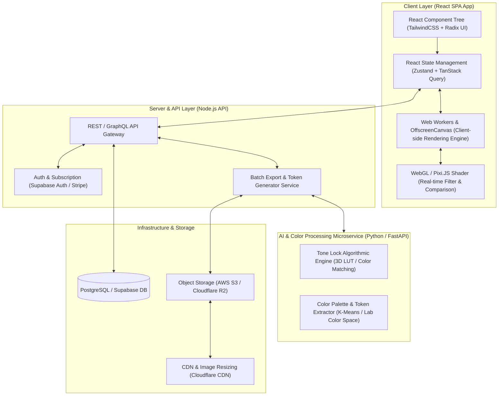
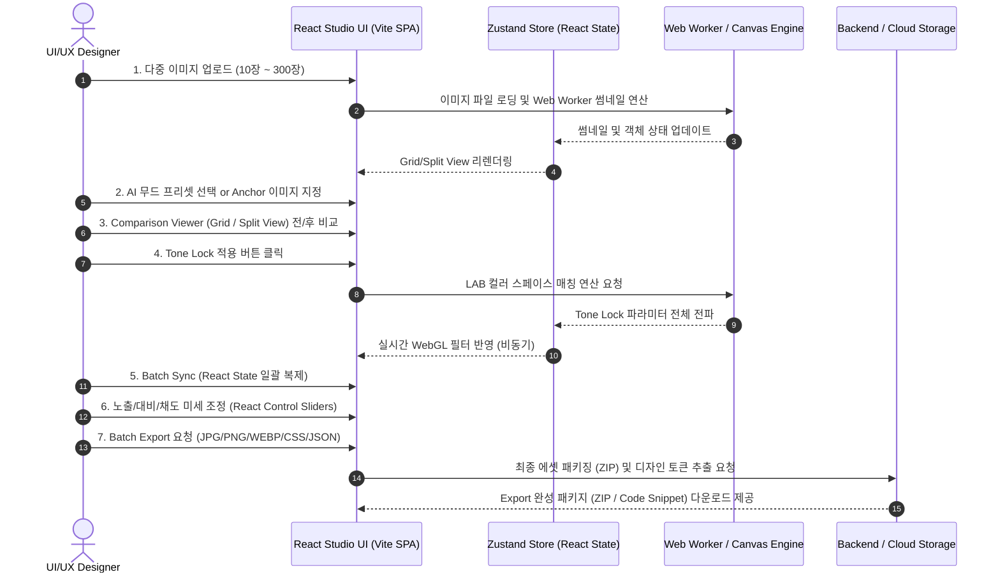
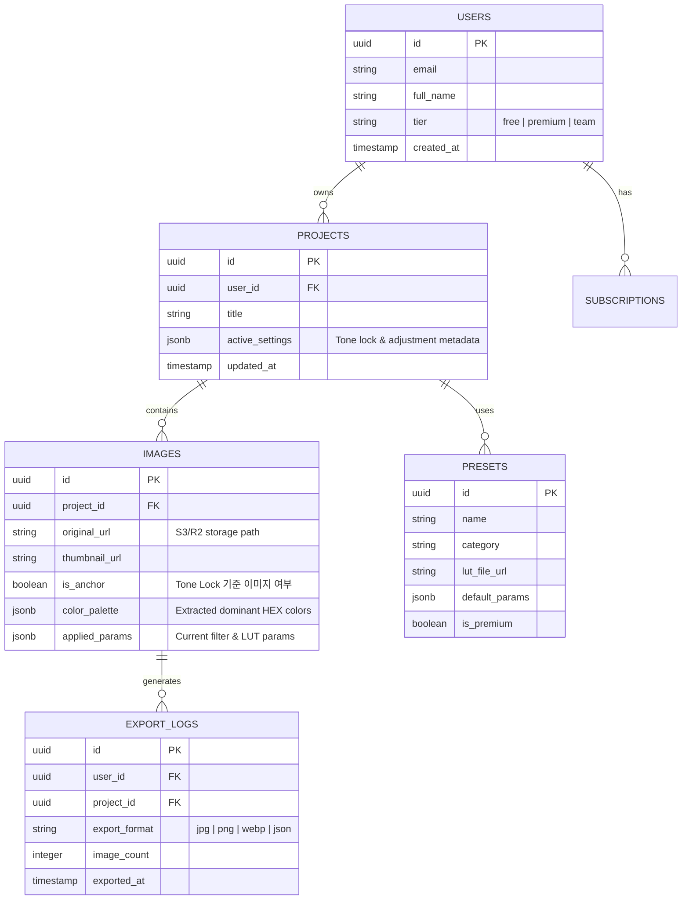
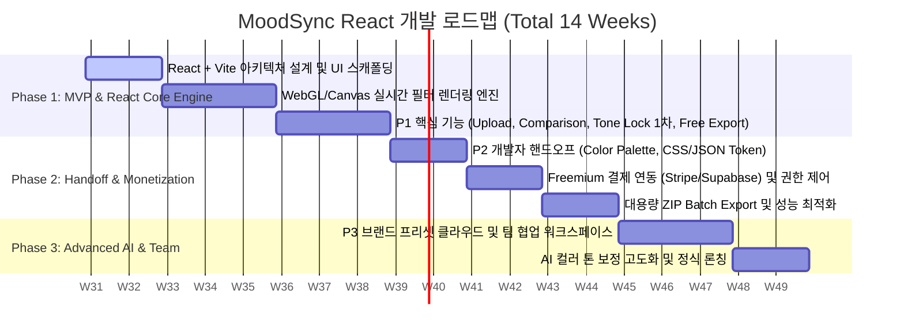

# [MoodSync] 감성 무드 필터 및 에셋 추출 웹 서비스 - 개발 기획서 (Technical Development Plan)

> **Document Version:** v1.1 (React SPA 기반 최적화)  
> **Target PRD Version:** MoodSync PRD v0.9 Draft  
> **Target Frontend Stack:** React (TypeScript) + Vite SPA Architecture  
> **Author:** Antigravity AI Coding Assistant  
> **Date:** 2026-07-27  

---

## 1. 프로젝트 개요 및 비전 (Executive Summary)

### 1.1 제품 개요
**MoodSync(무드싱크)**는 디자이너 및 프론트엔드 개발자를 위한 **React 기반 AI 감성 무드 변환 및 톤앤매너 일관성 유지 플랫폼**입니다. 
생성형 AI(Midjourney, Stable Diffusion 등)나 스톡 사진을 통해 수집한 다양한 이미지 자산들이 프로젝트 전반에서 동일한 분위기와 일관된 톤앤매너(Tone & Manner)를 유지하도록 지원하며, 나아가 디자인 후반 작업(Post-Production)의 규격화와 개발자 핸드오프(Handoff) 자동화를 달성하는 것을 목표로 합니다.

### 1.2 비전 및 비즈니스 목표
- **제품 비전:** *"AI 이미지 생성 이후의 디자인 후반 작업(Post-Production) 표준화"*
- **핵심 목표 (Targets):**
  1. **디자인 작업 시간 70% 절감:** 개별 이미지 색조 보정 및 수동 에셋 추출 시간의 혁신적 단축
  2. **브랜드 톤앤매너 일관성 보장:** Tone Lock 알고리즘을 통한 브랜드 비주얼 아이덴티티 균일화
  3. **개발자 핸드오프 자동화:** 이미지 에셋(JPG/PNG/WEBP), 색상 코드(HEX), CSS 필터 속성, JSON 디자인 토큰의 원클릭 추출 및 동기화

### 1.3 타겟 사용자 페르소나 및 핵심 가치 (USP)
| 타겟 사용자 | 주요 Pain Point | MoodSync가 제공하는 해결 가치 (USP) |
| :--- | :--- | :--- |
| **UI/UX 디자이너** | 웹/앱 서비스 내 이미지들의 색상 톤이 불일치함 | **Tone Lock** 기반 일관성 유지 및 **Comparison Viewer** 실시간 검증 |
| **브랜드/마케팅 디자이너** | 캠페인 이미지 100~300장의 일괄 수작업 보정 | **Batch Sync** 및 **Batch Export**를 통한 대량 작업 자동화 |
| **프론트엔드 개발자** | 디자인 결과물을 코드(CSS/토큰)로 변환하는 소통 비용 | **CSS Filter / HEX Palette / JSON Design Token** 자동 추출 및 Handoff |

---

## 2. 시스템 아키텍처 및 권장 기술 스택 (System Architecture & Tech Stack)

사용자의 요구사항에 맞추어 **React (TypeScript) 기반의 고성능 SPA(Single Page Application)** 아키텍처로 설계되었습니다. 대용량 고해상도 이미지(최대 300장)의 실시간 렌더링 및 색상 분석을 처리하기 위해 **React Virtual Dom + 클라이언트 사이드 GPU 가속(WebGL/Canvas) 및 Web Worker 비동기 병렬 처리**를 극대화합니다.



### 2.1 영역별 상세 스택 (React 기반)
1. **Frontend (React Client Application):**
   - **Core Library:** **React 18 / 19 (TypeScript)** – React Hooks 기반의 직관적인 컴포넌트 상태 분리 및 반응형 UI 구축
   - **Build Tool:** **Vite** – 고속 HMR(Hot Module Replacement) 및 빠른 빌드 속도로 개발 생산성 극대화
   - **State Management:** **Zustand** (React 컴포넌트 전역 이미지 데이터 및 실시간 제어 파라미터 관리) + **TanStack Query (React Query)** (서버 비동기 데이터 캐싱)
   - **Image Rendering Engine:** **Canvas API / WebGL (Pixi.js or React-Three-Fiber)** – 60fps 이상의 지연 없는 실시간 필터 적용 및 Split View 비교 렌더링
   - **Non-blocking Processing:** **Web Workers / OffscreenCanvas** – 대용량 이미지 썸네일 생성 및 클라이언트 배치 처리가 메인 UI 스레드를 차단하지 않도록 완전 분리
   - **UI / Styling:** **Tailwind CSS + Radix UI / Lucide React** – 디자이너 타겟의 수려하고 모던한 다크 모드(Dark Mode) UX, Glassmorphism, 부드러운 마이크로 애니메이션 제공

2. **Backend & AI Microservice:**
   - **Core API Server:** **Node.js / Express or NestJS (TypeScript)** – 엔터프라이즈 급 모듈 구조, 인증/결제/프로젝트 메타데이터 CRUD 및 API 통제
   - **AI Tone & Color Service:** **Python (FastAPI + PyTorch/OpenCV/Pillow)**
     - *Tone Lock Engine:* 기준 이미지(Anchor Image)와 대상 이미지 간의 LAB 컬러 스페이스 분포 분석, 히스토그램 매칭(Histogram Matching), 3D LUT(Look-Up Table) 생성 및 매핑 알고리즘
     - *Palette & Token Extractor:* K-Means 클러스터링 기반 주요 색상 추출, WCAG 명도 대비 및 디자인 토큰(W3C Design Token JSON, CSS Variables) 자동 포맷팅

3. **Database & Infrastructure:**
   - **Database:** **PostgreSQL (Supabase)** – 유저 프로필, 프로젝트, 프리셋, 사용량 통계(Freemium 제어용) 관리
   - **Storage:** **AWS S3 / Cloudflare R2** – 업로드 원본 및 Export 압축 파일(ZIP) 저장 (무료 사용자의 임시 파일은 24시간 후 자동 삭제되는 Lifecycle Rule 적용)
   - **Monetization (Freemium):** **Stripe API + Supabase Auth** – 회원가입 전환, 구독 결제 및 요금제별 제한(Rate Limit, 해상도 분기) 통제

---

## 3. 유저 저니(User Journey) 및 React 데이터 흐름도

사용자가 React 앱에 접속하여 최종 개발자 핸드오프 에셋을 추출하기까지의 7단계 핵심 유저 저니와 React 상태/컴포넌트 인터랙션 흐름입니다.



---

## 4. 기능 요구사항 및 세부 명세 (Functional Specification)

PRD에 정의된 우선순위(P1~P3)를 기준으로 한 세부 개발 기능 명세서입니다.

### 4.1 [P1-01] 다중 이미지 배치 업로드 (Multi-image Upload)
- **User Story:** 사용자는 여러 장의 이미지 파일을 드래그 앤 드롭으로 한번에 업로드하여 React 앱 스튜디오에 등록할 수 있다.
- **상세 명세:**
  - 지원 포맷: `JPG`, `PNG`, `WEBP`, `HEIC` (HEIC의 경우 클라이언트 Canvas/Web Worker를 통해 WEBP/JPEG로 즉시 변환)
  - 용량 및 장수 제한 검증: Free 티어 최대 10장 / Premium 티어 최대 300장 제한 검증 로직 구현
  - 비동기 처리: 업로드된 파일의 File Reader 및 리사이즈 썸네일 생성은 OffscreenCanvas 기반 Web Worker에서 수행하여 React 메인 UI 스레드를 차단(Freeze)하지 않도록 처리

### 4.2 [P1-02] AI 무드 프리셋 (AI Mood Presets)
- **User Story:** 사용자는 한 번의 클릭으로 큐레이션된 고품질 감성 필터를 선택하여 이미지에 적용할 수 있다.
- **상세 명세:**
  - 카테고리별 프리셋 라이브러리 제공 (Cinematic, Vintage, Warm Film, Clean Monochrome, Cyberpunk Vibe 등)
  - 기술 구조: 각 프리셋은 `.cube` 또는 `.png` 형태의 **3D LUT(Look-Up Table)** 및 색상 조정 파라미터(밝기, 대비, 채도, 색온도, 틴트, 비네팅 등)의 JSON 구조체로 정의
  - Freemium 제어: 기본 프리셋 10종 무료 제공, 전체 프리셋(50종 이상) 및 프리미엄 전용 필터는 유료 구독 권한 체크

### 4.3 [P1-03] Comparison Viewer (실시간 비교 뷰어)
- **User Story:** 사용자는 이미지 변환 전과 후의 차이를 시각적으로 즉시 비교하고 검증할 수 있다.
- **상세 명세:**
  - **Grid View Mode:** 여러 장의 이미지 각각에 대해 원본/변환을 토글하거나 일괄 전/후 전환 버튼 제공
  - **Split View Mode (Interactive Swipe Slider):** 화면 중심에 React 마우스/터치 이벤트를 바인딩한 핸들 바(Handle Bar)를 구성하여 좌우 마우스 드래그(스와이프)로 원본(Before)과 보정본(After)을 매끄럽게 비교
  - 줌 및 팬(Zoom & Pan): 이미지 확대(최대 400%) 및 마우스 드래그 픽셀 단위 퀄리티 검증 기능 (WebGL 가속 렌더링)

### 4.4 [P1-04] Tone Lock (톤앤매너 고정 엔진) [⭐ 핵심 USP 기능]
- **User Story:** 사용자는 특정 기준 이미지(Anchor Image)의 무드와 색조를 마스터 톤으로 고정하여, 서로 다른 환경에서 촬영/생성된 대상 이미지들의 톤을 일치시킬 수 있다.
- **상세 기술 로직 (Tone Lock Algorithm):**
  1. **Color Space 변환:** RGB 이미지를 인간의 시각 인지와 일치하는 **CIE LAB** 또는 **HSL** 컬러 스페이스로 변환
  2. **통계 추출:** 기준(Anchor) 이미지의 L(명도), a(적-녹 색도), b(황-청 색도) 채널별 평균(Mean)과 표준편차(Standard Deviation) 계산
  3. **히스토그램 매칭 (Color Transfer):** Reinhard Color Transfer 또는 3D LUT 매핑 알고리즘을 적용하여 대상 이미지의 색상 분포를 Anchor 이미지의 평균 및 분산 곡선에 일치시킴
  4. **React 실시간 반영:** 연산된 파라미터 및 임시 LUT를 WebGL 셰이더 및 Zustand 전역 상태를 통해 대상 이미지 컴포넌트에 16ms 이내 적용

### 4.5 [P1-05 & P1-06] Batch Sync & Batch Export (배치 동기화 및 일괄 내보내기)
- **User Story:** 사용자는 단일 이미지에서 완성된 보정 설정(Tone Lock + 미세 조정)을 전체 이미지에 일괄 적용하고, 원하는 포맷으로 일괄 다운로드할 수 있다.
- **상세 명세:**
  - **Batch Sync:** 선택된 단일/다중 대상 이미지(체크박스 선택 또는 전체 선택)에 톤 파라미터 JSON 속성을 Instant Copy & Paste
  - **Batch Export Engine:**
    - 이미지 변환 포맷 옵션: `JPG` (압축률 조절 60~100%), `PNG` (무손실), `WEBP` (고효율 모던 포맷)
    - Freemium 해상도 분기 로직:
      - **Free Tier:** 최대 긴 변 기준 `1080px` 리사이징 렌더링 후 변환
      - **Premium Tier:** 업로드된 `원본 해상도 (Original Resolution)` 그대로 렌더링
    - 패키징: 브라우저 내에서 `JSZip` 라이브러리 활용 (10~20장 이하) 또는 백엔드 Worker를 통한 대용량 다중 스트리밍 ZIP 생성 후 다운로드 링크 제공

### 4.6 [P2-01 & P2-02] 개발자 핸드오프: Color Palette & CSS/JSON Design Token Export [⭐ 핵심 USP 기능]
- **User Story:** 디자이너와 개발자가 별도의 소통 과정 없이, 변환된 이미지의 색상 정보와 스타일 속성을 코드 형태로 즉시 프로젝트에 적용할 수 있다.
- **상세 명세:**
  - **Color Palette Extraction (HEX/RGB/HSL):**
    - 이미지 픽셀 데이터를 K-Means 알고리즘으로 군집화하여 주요 색상(Dominant Colors) 5~8색 추출
    - 각 색상의 HEX 코드, RGB, HSL 및 WCAG 명도 대비(Contrast Ratio)에 따른 추천 배경/텍스트 조합 제시
  - **CSS Filter Code Export:**
    - 웹 퍼블리싱 시 이미지 자체를 변환하지 않고 CSS 속성만으로 보정 효과를 재현할 수 있는 스타일 코드 제공
    - 예시 출력: `filter: contrast(105%) brightness(98%) saturate(120%) sepia(10%) hue-rotate(-5deg);`
  - **JSON Design Token Export (W3C Standard & Tailwind Compatible):**
    - 디자인 시스템 및 모던 프론트엔드 환경에서 즉시 import 가능한 JSON 구조 생성
    - 출력 포맷 (예시):
      ```json
      {
        "moodsync": {
          "palette": {
            "primary": { "value": "#2A3B4C", "type": "color" },
            "secondary": { "value": "#8E7B6D", "type": "color" },
            "accent": { "value": "#D4A373", "type": "color" }
          },
          "imageFilter": {
            "default": { "value": "contrast(1.05) saturate(1.2)", "type": "custom-css" }
          }
        }
      }
      ```

### 4.7 [P3-01 & P3-02] 브랜드 프리셋 및 팀 협업 (Brand Presets & Team Collaboration)
- **User Story:** 브랜드팀 디자이너들이 고유한 브랜드 가이드라인 필터를 저장하고, 팀원들과 클라우드 워크스페이스에서 자산을 공유할 수 있다.
- **상세 명세:**
  - 커스텀 파라미터 및 추출된 3D LUT를 브랜드 프리셋(My Brand Presets) 클라우드에 영구 저장
  - 팀 워크스페이스(Organization/Team CRUD) 생성 및 역할 기반 접근 제어(RBAC: Admin, Editor, Viewer) 도입
  - 실시간 댓글 및 핸드오프 링크 공유 (Shareable Preview Link via Supabase DB)

---

## 5. Freemium 요금제 및 권한 통제 아키텍처 (Freemium Paywall Routing)

무료 서비스와 유료 서비스의 명확한 가치 차별화(Paywall Wall) 및 시스템적 분기 제어 설계입니다.

| 구분 / 기능 | Free Tier (무료) | Premium Tier (유료) | 시스템 제어 및 통제 방식 (Technical Guardrails) |
| :--- | :--- | :--- | :--- |
| **최대 해상도** | 1080px (FHD 제한) | **원본 해상도 (Original)** | Export 렌더링 시 OffscreenCanvas에서 1080px 초과 여부 체크 후 Resize 다운스케일 강제 적용 |
| **동시 업로드 장수** | 최대 10장 | **최대 300장** | File Dropzone UI 및 React State 배열 길이 10 초과 시 예외 처리 및 유료 전환 모달 트리거 |
| **제공 무드 프리셋** | 기본 프리셋 10종 | **전체 프리셋 (50종+)** | 프리셋 메타데이터 DB 테이블의 `is_premium: boolean` 플래그 체크 |
| **Export 지원 포맷** | JPG 전용 | **PNG, JPG, WEBP + 토큰** | Export 모달에서 PNG, WEBP 및 Design Token 탭 비활성화(Disabled) 및 잠금 아이콘 표시 |
| **개발자 핸드오프** | CSS Filter 기본 제공 | **HEX / JSON Token 풀 셋** | JSON Design Token 다운로드 버튼 클릭 시 Premium 구독 상태(Stripe Token) 검증 |

---

## 6. UI/UX 화면 구성 및 레이아웃 설계 (Studio Layout Blueprint)

작업 시간 70% 절감을 달성하기 위해, React 컴포넌트 아키텍처에 맞춘 **3-Column Studio Layout**과 직관적인 **Dark Mode Glassmorphic UI**를 채택합니다.

```
+----------------------------------------------------------------------------------------------------+
|  [MoodSync Logo]   Workspace: Campaign_2026   [Free Tier Badge -> Upgrade]     [Export All Button] |
+------------------------------------+------------------------------------+--------------------------+
| 1. CONTROL & ASSET PANEL           | 2. CENTER CANVAS (COMPARISON VIEW) | 3. HANDOFF & ADJUSTMENT  |
|                                    |                                    |                          |
| [ + Upload Images (Drag & Drop) ]  |  Mode: [ Grid View ] [ Split View ]| [ Tone Lock Engine ]     |
| ---------------------------------- |  +------------------------------+  | Target: All (10 Images)  |
| Active Assets (10/10)              |  |                              |  | Anchor: [Img_001.png]    |
| +--------+  +--------+  +--------+ |  |         BEFORE  |  AFTER     |  | [ Apply Tone Lock ]      |
| | Img_01 |  | Img_02 |  | Img_03 | |  |                 |            |  | ------------------------ |
| |(Anchor)|  | (Sync) |  | (Sync) | |  |  (Swipe Slider Interactivity)|  | [ Micro-adjustments ]    |
| +--------+  +--------+  +--------+ |  |                 |            |  | Brightness  [-O-------]  |
|                                    |  +------------------------------+  | Contrast    [----O----]  |
| [ AI Mood Presets Library ]        |  Zoom: [ 100% v ]  [ Before/After ]| Saturation  [-----O---]  |
| - (*) Cinematic Vintage (Free)     |                                    | ------------------------ |
| - ( ) Cyberpunk Neon (Premium)     |  [ Grid Thumbnails Quick Bar ]     | [ Developer Handoff ]    |
| - ( ) Warm Kodak Film (Free)       |  [Img 1] [Img 2] [Img 3] [Img 4]   | Palette: #2A3B #8E7B #D4A|
|                                    |                                    | [ Copy CSS ] [ Export JSON]|
+------------------------------------+------------------------------------+--------------------------+
```

---

## 7. 데이터베이스 스키마 설계 (Database Schema Outline)

PostgreSQL (Supabase) 기준 핵심 테이블 스키마 구조입니다.



---

## 8. 단계별 개발 로드맵 및 마일스톤 (Phased Execution Plan)

프로젝트 목표(작업 시간 70% 절감, 개발자 핸드오프 자동화)를 빠르게 검증하고 시장에 출시하기 위한 3단계 로드맵입니다.



### 8.1 Phase 1: MVP & React Core Engine (1 ~ 8주차)
- **목표:** React 기반의 핵심 USP(Comparison Viewer, Tone Lock, Batch Sync)를 구현하여 Product-Market Fit(PMF) 검증
- **주요 산출물:**
  - React (TypeScript) + Vite 기반 3-Column Studio Workspace UI 구축
  - WebGL/Canvas 실시간 이미지 필터 렌더러 및 Web Worker 썸네일 엔진
  - LAB 컬러 스페이스 기반 Tone Lock 알고리즘 1차 버전 구현
  - Free 티어 1080px JPG Batch Export

---

## 9. 비기능적 요구사항 및 위험 관리 (Non-Functional Requirements & Risk Mitigation)

### 9.1 React 대용량 렌더링 성능 최적화 (Performance Optimization)
- **이슈 (Risk):** 300장의 고해상도 이미지를 브라우저에 동시 로딩할 경우 React 컴포넌트 리렌더링 과부하 및 메모리 부족 발생 가능성
- **해결 방안 (Mitigation):**
  1. **React Component Virtualization:** `TanStack Virtual` 또는 `react-window`를 도입하여 뷰포트(Viewport) 화면에 노출되는 썸네일 영역만 메모리에 렌더링하고 나머지는 언마운트 처리
  2. **React State Decoupling:** 개별 슬라이더 이동 시 전체 리스트가 불필요하게 리렌더링되지 않도록 Zustand의 Selector 구독 패턴(`useMoodSyncStore(state => state.activeImage)`) 적용
  3. **GPU Acceleration:** CSS 필터 DOM 조작 대신 Pixi.js 기반 단일 WebGL 컨텍스트 셰이더로 병렬 연산 수행

---

## 10. 결론 및 바로 실행 가능한 Next Step

본 기획서는 React 기술 스택을 기반으로 `MoodSync_PRD.md`에 기술된 **"디자인 작업 시간 70% 절감"** 및 **"개발자 핸드오프 자동화"**라는 가치를 실현하기 위해 최적화된 사양을 반영했습니다.

### 💡 바로 실행 가능한 Action Items (React 개발 환경)
1. **React (TypeScript) + Vite 프로젝트 초기화:** `npm create vite@latest moodsync-react -- --template react-ts` 명령어로 고성능 React 개발 환경 구축
2. **React 컴포넌트 및 Zustand 스토어 이식:** 3-Column 레이아웃 컴포넌트, Tone Lock 엔진 및 개발자 핸드오프 스위트 모듈 연동
3. **React-WebGL 프로토타입 검증:** Split View 비교 뷰어 및 JSZip 대용량 Export 파이프라인 통합 테스트

> *본 기획서에 반영된 React 기반 개발 계획에 맞춰 추가 조율이 필요한 사항이 있으시면 말씀해 주세요!*
